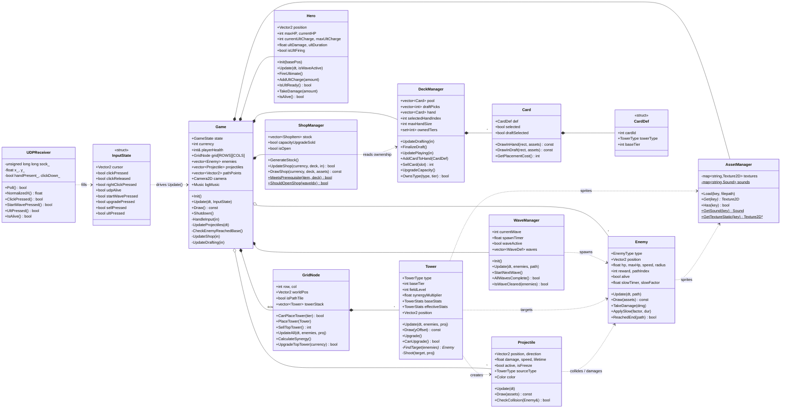

# UML Class Diagram — demosem2game

Tower-defense game (C++ / raylib) dengan kontrol *hand-tracking* (Python MediaPipe → UDP).

## Catatan relasi

| Relasi | Arti |
|--------|------|
| `*--` (komposisi) | `Game` memiliki & mengelola lifecycle subsistem; `GridNode` memiliki `towerStack` |
| `o--` (agregasi) | koleksi `enemies` / `projectiles` yang dinamis |
| `..>` (dependensi) | satu kelas memakai/membaca kelas lain tanpa memilikinya |

## Alur utama
1. **`main.cpp`** → `UDPReceiver::Poll()` membaca gesture tangan dari Python → mengisi `InputState`.
2. `Game::Update()` mendelegasikan ke subsistem sesuai `GameState` (MAIN_MENU → DRAFTING → PLAYING ↔ SHOP → GAME_OVER/VICTORY).
3. **PLAYING**: `WaveManager` spawn `Enemy` → `GridNode`/`Tower` menembak (`Projectile`) → `Hero` ultimate → reward menambah `currency`.
4. Tiap `SHOP_WAVE_INTERVAL` wave → `ShopManager` menjual kartu T2/T3 (dengan aturan prasyarat tier dari `DeckManager`).
